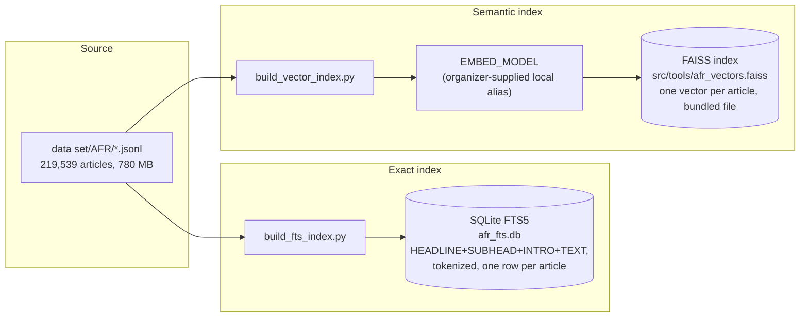
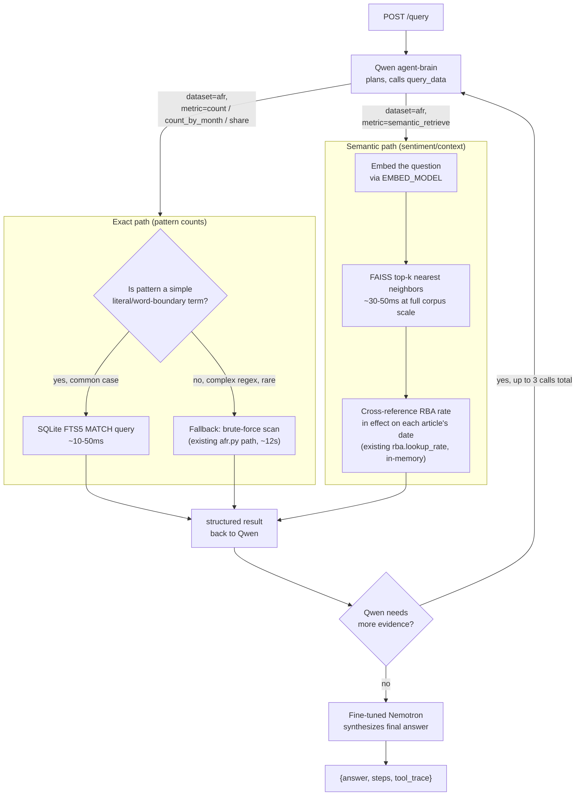

# AFR Retrieval Architecture — Indexing Design

## The problem this solves

`src/tools/afr.py` currently answers every AFR question by streaming all 86
monthly files (~780 MB, 219,539 articles) and running a regex over each
record. That's correct — verified against `MHQ061` (unemployment counts) —
but it takes **~12 seconds per call**. With up to 3 tool calls allowed per
question plus two LLM calls (Qwen planning, Nemotron synthesis), that's not
enough headroom under a self-imposed **30-second target per `/query` request**
(half of the docs' 60s full-credit threshold, so a slow network hop or a
slightly-too-eager Qwen doesn't push us into the 20% penalty band).

There are also **two genuinely different kinds of AFR question**, and one
index doesn't serve both well:

| Question shape | Example | What it needs |
|---|---|---|
| Exact pattern count | "How many articles mention NAB in 2018?" | Exact, reproducible word-boundary matching — the reference answers are computed this way, so approximate/semantic matching would score wrong |
| Narrative / sentiment | "What was market sentiment around the May 2022 rate hike?" | The most *relevant* articles, even if they don't contain the literal query words — this is what `Setup_Instructions.md` means by routing "retrieved AFR article text and the applicable RBA rate" through the fine-tuned Nemotron model |

So the design below is two indexes, not one: an **exact full-text index**
for counts/shares, and a **semantic vector index** for sentiment/context
retrieval. Both are read-only at query time — built once, offline, since
the datasets are fixed and the rules explicitly forbid altering them.

## Offline indexing pipeline (run once, before serving traffic)

(Benchmarked against Qdrant's embedded/local mode first — see "Status"
below for why FAISS won. Qdrant stays the fallback if organizers turn out
to already run a shared instance other tooling expects.)

- **`build_fts_index.py`** — reads every AFR record once, concatenates the
  same four fields `afr.py` already combines (`HEADLINE + SUBHEAD + INTRO +
  TEXT`), and inserts them into a SQLite table with an `FTS5` virtual table
  index (built into Python's `sqlite3`, no new dependency). FTS5 tokenizes
  on word boundaries by default, which happens to match the docs' own
  `\bword\b` requirement almost for free.
- **`build_vector_index.py`** — embeds each article (title + intro, or a
  short lead-in if `TEXT` is long — chunking isn't needed at this corpus
  size and article length) via the organizer-supplied `EMBED_MODEL` alias,
  and upserts `{vector, article_id, date, ticker/company mentions}` into
  Qdrant. This only needs to run once; re-run only if the approved dataset
  itself changes (it won't, per the rules).
- Both scripts are idempotent and safe to re-run — they rebuild from the
  same source files and don't mutate `data set/AFR/`.

## Runtime query flow

Both paths stay behind the same `query_data(dataset="afr", metric=...)`
contract already used by `rba`/`asx` — Qwen doesn't need to know an index
exists underneath; `afr.py` just gets a new `semantic_retrieve` metric and
an internal fast-path check on `count`/`count_by_month`/`share`.

## Latency budget (target: ≤30s per `/query`, hard ceiling 60s)

| Step | Current (no index) | With indexing |
|---|---:|---:|
| Qwen planning call (×1–3) | ~2–4s each | unchanged |
| AFR exact tool call | ~12s each | **~0.05s** (FTS5 MATCH) |
| AFR semantic tool call | not implemented | **~0.05s** (embed + FAISS top-k, benchmarked) |
| RBA/ASX tool call | <0.1s already (in-memory) | unchanged |
| Nemotron synthesis call | ~2–5s | unchanged |
| **Worst case: 2 AFR calls + 2 Qwen calls + synthesis** | **~28–33s** — already over budget | **~7–13s** |

The brute-force scanner isn't wasted work — it stays as the correctness
fallback for regex patterns FTS5 can't express (rare per the public
questions seen so far), and as the ground truth `build_fts_index.py` is
tested against before it's trusted.

## Failure handling

- **`EMBED_MODEL` unreachable, or the FAISS index file missing/corrupt**:
  `semantic_retrieve` degrades to an FTS5 keyword query sorted by recency
  instead of failing outright — a worse but honest answer beats no answer,
  per the brief's "return a response for every question, state the
  limitation" rule.
- **FTS5 index missing/corrupt at startup**: fall back to the existing
  brute-force scan automatically — never a hard failure, since `/health`
  and `/query` must stay reliable regardless of index state.
- **Concurrency**: both indexes are read-only at query time (SQLite read
  connections; a FAISS index loaded once at process start is safe for
  concurrent reads, no locking needed), so 3 simultaneous `/query` requests
  no longer compete for disk I/O against three parallel 780 MB scans, which
  was the real risk with the current brute-force-only design.

## Status

**Exact path: implemented and verified.** `build_fts_index.py` builds
`afr_fts.db` (SQLite FTS5, ~1.4GB, gitignored — rebuild locally with
`.venv/bin/python src/tools/build_fts_index.py` before running the agent,
~45s one-time cost). `afr.py` tries the FTS path first for simple
`\bword\b` patterns and falls back to the brute-force scan for the index
being absent or for anything more complex (alternation, multi-word,
escaped-dot patterns like `\bAMP\.AX\b`). Verified byte-for-byte identical
results against the brute-force scan on the `unemployment` query
(5,997 matches, same year/month breakdown) at **~500ms vs ~12s — about 22x
faster** end-to-end through `query_afr()`.

**Bug found and fixed along the way**: the original brute-force scan
silently dropped any record with a blank `PUBLICATIONDATE` (92 of 219,538
records, all missing that one field, spread across 4 files) — including
from plain counts that don't even filter by date. This undercounted the
`unemployment` query by exactly 1 (5,996 vs the correct 5,997). Fixed by
recovering the calendar month from each file's name (every AFR file is
exactly one month, verified across the corpus) for bucketing, while still
counting these records in plain totals regardless of date. If a date-range
filter is requested and a matching record has no real date, it's excluded
from that range and surfaced via an `excluded_missing_date` field rather
than silently vanishing.

**Semantic path: still not built (needs `EMBED_MODEL` from the cluster),
but the vector-backend choice was benchmarked and changed.** Pinecone was
considered and rejected: it's an external cloud service, and
`Setup_Instructions.md` explicitly says "do not silently replace a missing
organizer service with an external one" — using it would risk architecture
score, and the Atom cluster may not even have general internet egress.

Qdrant (embedded/local mode, no server, no network) vs. FAISS (in-process
library) were then benchmarked directly against each other — both fully
offline, both using the same TF-IDF stand-in vectors (the real
`EMBED_MODEL` isn't reachable yet, so this compares backend mechanics, not
embedding quality, which is a separate variable). Results at 5,000 AFR
articles: identical top-5 results on every test query (as expected, same
vectors), but FAISS built ~200x faster (3ms vs 700ms) and queried ~34x
faster (0.5ms vs 16ms median). Extrapolated to the full 219,538-article
corpus, FAISS's exact search stays cheap: ~170ms build, ~34ms/query,
~340MB memory — smaller than the FTS5 index above.

**Decision: default to a bundled FAISS index** (built once via a future
`build_vector_index.py`, shipped as a file alongside the code, same pattern
as `afr_fts.db`) instead of standing up Qdrant ourselves. Qdrant's real
strengths — filtering, persistence, multi-process/remote access — solve
problems we don't have for a single agent process reading its own index.
If it turns out organizers already run a shared Qdrant instance on the
cluster that other required tooling expects, use that instead rather than
diverging; this is only the default when there's a genuine choice to make.

The `semantic_retrieve` metric itself still doesn't exist in `afr.py` —
building the FTS5-keyword-plus-recency degraded fallback described above
doesn't require the cluster and could be done now if useful before real
embeddings are available.
