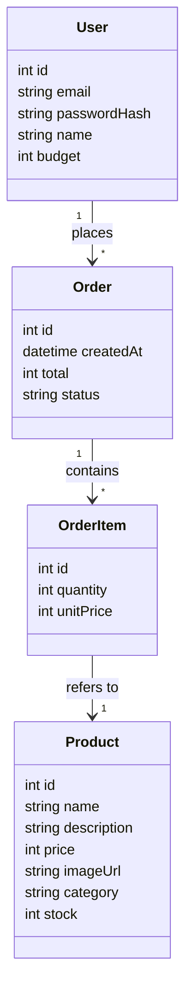

# Jane's Furniture Buyer Site — Architecture

This is the "how it's built" document. For "what to build", see
[requirements.md](requirements.md). For "why this tech and how to work with
Claude on this project", see [CLAUDE.md](CLAUDE.md).

## 1. System overview

Everything runs in one Next.js project — there is no separate backend to
deploy or keep in sync. Next.js serves the pages the buyer sees *and* handles
the behind-the-scenes logic (checking a password, saving an order) as part of
the same program.

```
                 ┌─────────────────────────────────────────┐
                 │              Browser                      │
                 │   (login form, catalogue + basket, orders) │
                 └───────────────────┬─────────────────────┘
                                     │ HTTP
                                     ▼
                 ┌─────────────────────────────────────────┐
                 │               Next.js app                  │
                 │                                             │
                 │  Pages (what you see)                      │
                 │   /login   /  (catalogue)   /orders         │
                 │                                             │
                 │  API routes (server-side logic)            │
                 │   /api/login  /api/logout  /api/checkout    │
                 └───────────────────┬─────────────────────┘
                                     │ Prisma (data access layer)
                                     ▼
                 ┌─────────────────────────────────────────┐
                 │          SQLite database (one file)        │
                 │   Users · Products · Orders · OrderItems   │
                 └─────────────────────────────────────────┘
```

Nothing in this diagram needs to be started separately — `npm run dev` starts
the whole thing, database included. There is no separate `/cart` page — the
basket lives in a dropdown attached to the account menu in the header (see
"2.1 Where the basket lives" below), available from any page.

## 2. Components and their responsibilities

| Component | Responsibility |
|---|---|
| **Pages** (`src/app/*/page.tsx`) | What renders in the browser. Fetch data, show it, collect input. |
| **API routes** (`src/app/api/*/route.ts`) | The only place that touches passwords, sessions, and budget maths. Pages call these; pages never talk to the database directly. |
| **Prisma** (`prisma/schema.prisma` + generated client) | Translates between plain JavaScript objects and rows in the database. |
| **SQLite file** (`dev.db`, project root) | The actual data, on disk, as one file. |
| **`lib/session.ts`** | Reads and writes the signed cookie that says "this browser is logged in as user X". |
| **`lib/money.ts`** | Converts between cents-as-integer (storage) and "A$12.50" (display). |
| **`lib/basket-context.tsx`** | Holds basket state (line items, checkout call, errors) so it's reachable from components that aren't parent/child of each other. See 2.1. |
| **`AccountMenu`** | The dropdown in the header: account info, the live basket, and Catalogue / My orders / Log out links. |
| **`ProductCard`** | One product tile: image, price, quantity picker, "Add to basket" — reads the basket via context directly. |

**Rule of thumb:** a page shows things and collects clicks; an API route
decides whether something is *allowed* and makes it *true* in the database.
Anything security- or money-related happens in an API route, never trusted
from the browser alone.

### 2.1 Where the basket lives

The basket needs to be reachable from two places that aren't parent/child of
each other: `ProductCard`'s "Add to basket" button (inside the product grid)
and `AccountMenu`'s dropdown (in the header, rendered as a sibling of the
grid, not a descendant). React Context is the standard tool for exactly this
"two unrelated components need the same state" situation, so basket state
lives in `BasketProvider` (`lib/basket-context.tsx`), not inside either
component.

- Only the home page (`page.tsx`) is wrapped in `<BasketProvider>` — there's
  nothing to add to a basket from the orders page.
- `useBasket()` returns `null` when called outside a provider, rather than
  throwing. This lets `AppHeader`/`AccountMenu` render on every page: on the
  orders page they just skip the basket section instead of crashing.
- Adding an item increments a counter (`lastAddedAt`) that `AccountMenu`
  watches to auto-open the dropdown. It deliberately does *not* watch the
  whole basket object, since that object is a new reference on every
  render — watching it directly would reopen the menu on every quantity
  edit, not just on add.

## 3. Key flows

### 3.1 Login

1. Buyer submits email + password on `/login`.
2. `/api/login` looks up the user by email, compares the submitted password
   against the stored **hash** using bcrypt (the real password is never
   stored, so there's nothing to compare "directly").
3. If it matches, the server creates a signed cookie identifying that user
   and sends it back to the browser.
4. Every later request automatically includes that cookie. `lib/session.ts`
   reads it on each protected page/API route to know who's asking.
5. Logout clears the cookie.

### 3.2 Browsing the catalogue

1. The home page (`/`) asks Prisma for products (capped at 24 — see
   "Where Product rows actually come from" below).
2. Products render as cards: image, name, price (converted from cents to
   A$ by `lib/money.ts`), an "Add to basket" control.
3. The basket itself lives in the browser (not the database) until checkout
   — it's just a list of "product id + quantity" the buyer is still deciding
   on.

### 3.3 Checkout (the important one)

This is the one flow where getting the order of operations right matters,
because it's the only place real "state" changes:

1. Buyer clicks "Place order" with items in their basket.
2. The browser sends the basket contents to `/api/checkout`.
3. The server — not the browser — looks up the buyer's budget and how much
   they've already spent (sum of past orders).
4. The server recalculates the basket total itself from the current product
   prices in the database (never trusts a total sent from the browser — a
   buyer could otherwise edit that number in their browser's dev tools).
5. If `basket total > remaining budget`, the request is rejected with a clear
   error. Nothing is saved.
6. If it's within budget, the server creates an `Order` plus its `OrderItem`
   rows in a single database transaction (so it's never left half-saved).
7. The new order appears immediately in the buyer's order history.

The reason step 3–4 happen on the server: a disabled "place order" button in
the browser is a courtesy, not a security control. Anyone can bypass browser
JavaScript. The budget check that actually counts is the one in the API
route.

### 3.4 Viewing order history

1. The `/orders` page (linked as "My orders") asks Prisma for the logged-in
   buyer's own Orders, each with its OrderItems and each item's Product
   (for name and image).
2. Total spent is calculated the same way the budget check does —
   `sum(orders' totals)` — so the two numbers can never disagree.
3. Each line item shows the product's thumbnail image alongside its name,
   quantity, and price, so an order reads as "what I actually bought," not
   just a list of IDs and numbers.

## 4. Data model

Four things need remembering, matching the flows in [requirements.md](requirements.md):
who's shopping (**User** — the account behind each "Buyer"), what's for sale
(**Product**), what was bought (**Order**), and which products were in that
order (**OrderItem**).



### In plain English

- **User** is one buyer account: their login details (email +
  `passwordHash` — never the real password) and their **budget**, the total
  they're allowed to spend. This is the account behind the "Buyer" role
  described in requirements.md.
- **Product** is one catalogue item: name, description, price, an image, a
  category to group it by, and how many are in stock.
- **Order** is one completed checkout: which user placed it, when, and its
  total. It doesn't list *what* was bought directly — that's what OrderItem
  is for.
- **OrderItem** is one line inside an order: "3 of this product, at this
  price." A single Order can have several OrderItems (e.g. a sofa and two
  lamps in the same order).

The arrows read as "one of the first thing can have many of the second":

- **One User places many Orders** — a buyer can check out more than once.
- **One Order contains many OrderItems** — a single order can hold several
  different products.
- **Each OrderItem refers to one Product** — it points at exactly which
  catalogue item that line is.

Two prices are deliberately duplicated on purpose, not by accident:

- `OrderItem.unitPrice` is a **snapshot** of the price at the moment of
  purchase. If a product's price in the catalogue changes later, past orders
  still show what the buyer actually paid at the time.
- `Order.total` is a snapshot of the whole order's total, calculated once at
  checkout — so the order history doesn't have to be recalculated (and
  potentially drift) every time it's viewed.

**Remaining budget** is the one number that's deliberately *not* stored
directly — it's always calculated as `user.budget − sum(user's orders'
totals)`. That way there's only one number to keep correct (the budget
itself), instead of two numbers that could drift out of sync with each other.

### Where Product rows actually come from

`furniture-app/scripts/import-catalog.ts` populates the Product table from
an external MongoDB collection (762 real furniture items) rather than from
hand-written seed data. It's a one-off script, not something the running
app calls — the app only ever reads Products out of its own SQLite database,
same as the diagram in section 1 shows. Worth knowing if this runs again:

- Images are stored as `data:` URIs (base64 baked directly into `imageUrl`),
  not links to hosted files — the source database returned raw image bytes,
  not URLs, despite the field being called `image_url`.
- The script deletes and re-inserts every Product on each run, but refuses
  to do so if any `OrderItem` already references an existing Product — a
  guard against silently orphaning real order history.
- The home page (`src/app/page.tsx`) caps its query at 24 products
  (`take: 24`). With all 762 products carrying embedded images, an
  unpaginated page would ship several tens of megabytes of HTML on every
  load. Building real pagination or search is the natural next step if the
  catalogue stays this size.

## 5. Security model (demo-grade, stated plainly)

- Passwords: hashed with bcrypt before storage. Never logged, never stored
  as plain text.
- Sessions: a signed cookie naming the user id. "Signed" means the server can
  detect if a buyer tampers with the cookie's contents (they can't forge
  being a different user), but the cookie is not encrypted, and there's no
  expiry/rotation/rate-limiting logic. Fine for a demo; not fine for
  production.
- Authorization: every API route re-checks *who* is asking (via the cookie)
  before returning or changing *their* data. A buyer can only ever see their
  own orders and budget, not another buyer's — enforced server-side, not by
  hiding links in the UI.
- Budget enforcement: always recalculated server-side at checkout, as
  described in 3.3. This is the one check in the whole app that must not be
  removable by editing the browser.
- Explicitly not implemented: rate limiting, CSRF tokens, HTTPS (irrelevant
  on localhost), audit logs, password reset. See [CLAUDE.md](CLAUDE.md) for
  the full list of known limits.

## 6. Local development environment

- Runs entirely on one machine, no external services.
- The database is a single file (`dev.db`, project root — not inside
  `prisma/`, see the gotcha in [CLAUDE.md](CLAUDE.md)) — delete it and
  `npm run seed` to reset to a clean demo state at any point.
- `npx prisma studio` opens a browser tab showing the database as clickable
  tables — the easiest way to check "did that order actually save?" without
  reading any code.

## 7. Public access and future deployment

Two different things, worth keeping distinct:

**Right now:** the app is reachable from the internet via a Cloudflare
quick tunnel (`cloudflared tunnel --url http://localhost:3000`) — no
account or code changes needed, since the tunnel just forwards a public
HTTPS URL to the same `localhost:3000` the app already runs on. This is
demo-mode exposure: it depends on this one laptop keeping both the dev
server and the tunnel process running, and the URL changes on every tunnel
restart. See "Public access (tunnel)" in [CLAUDE.md](CLAUDE.md) for the
exact command and its limits.

**Later, if this needs to run independently of any one laptop** (e.g. a
judge opening it after the hackathon, with nobody's machine turned on):
that's a real deployment, and does require a code-relevant change —
SQLite's one-file database doesn't persist on most serverless hosts (e.g.
Vercel resets the filesystem on every deploy). Swapping to a hosted
Postgres database is a small, well-defined change — mostly one line in
`prisma/schema.prisma` plus a connection string — not a rewrite. Everything
else (pages, API routes, login logic) is host-agnostic and wouldn't need to
change. Deliberately not done yet — see the open questions in
[requirements.md](requirements.md).
